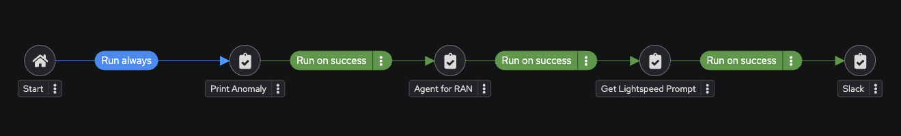

# Optimizing RAN operations with OpenShift AI and Remediation using Ansible Automation Platform

## Create Projects

I. Navigate to: Automation Execution → Projects → Create Project.

II. Fill in the details

| Parameter             | Value                                               |
   |-----------------------|-----------------------------------------------------|
   | Name                  | MyProject                                           |
   | Organization          | Default                                             |
   | Source Control Type   | Git                                                 |
   | Source Control URL    | https://github.com/saahmd/LLamaonOpenshift.git      |

III. Save and verify that **MyProject** status is **Success**.  

### Create Job Templates

I. Create "Print Anomaly" Template

   | Parameter       | Value                                |
   |-----------------|--------------------------------------|
   | Name            | Print Anomaly                 |
   | Inventory       | Demo Inventory                       |
   | Project         | MyProject                            |
   | Playbook        | playbooks/ai-ran-template.yml      |
   | Credentials     | AAP,lab-credential                                            |
   | Extra variables | full_anomaly_report: '{{ full_anomaly_report }}'  |

II. Create "Agent for RAN" Template

   | Parameter       | Value                                |
   |-----------------|--------------------------------------|
   | Name            | Agent for RAN                 |
   | Inventory       | Demo Inventory                       |
   | Project         | MyProject                            |
   | Playbook        | playbooks/ran_agent.yml      |
   | Credentials     | AAP,Demo Credential      |
   | Extra variables | llama_stack_url: llamastack-server-llama-serve.apps.cluster-w8px7.w8px7.sandbox1697.opentlc.com full_anomaly_report: '{{ full_anomaly_report }}'  |

#### Select Prompt on Launch Checkbox.
   

III. Create "Get Lightspeed Prompt" Template

   | Parameter       | Value                                |
   |-----------------|--------------------------------------|
   | Name            | Get Lightspeed Prompt         |
   | Inventory       | Demo Inventory                       |
   | Project         | MyProject                            |
   | Playbook        | playbooks/aap_create_job_template.yml      |
   | Credentials     | AAP                                          |

IV. Create "Send Report to Slack" Template
 | Parameter       | Value                                |
   |-----------------|--------------------------------------|
   | Name            | Send Report to Slack       |
   | Inventory       | Demo Inventory                       |
   | Project         | MyProject                            |
   | Playbook        | playbooks/slack_ran.yml      |
   | Credentials     | AAP                                          |
   

V. Create "RAN Antenna Configuration Workflow" Workflow Template

   

## Configure Apache Kafka Container

I. Create "Setup Kafka" Template

   | Parameter       | Value                                |
   |-----------------|--------------------------------------|
   | Name            | Setup Kafka                |
   | Inventory       | service-inventory                      |
   | Project         | MyProject                            |
   | Playbook        | playbooks/kafka.yml      |
   | Credentials     | AAP,lab-credential                                            |
   | Extra variables | kafka_external_hostname: service1.pchzg.sandbox2169.opentlc.com   |

   ### The kafka_external_hostname is similar to the Mattermost External Hostname except the https and port

II. Run the Setup Kafka template

III. log on to bastion or mac and test endpoint using:
    
       nc -vz service1.pchzg.sandbox2169.opentlc.com 9092

IV. log on the service1 host and exec into cp-kafka pod
    
    podman exec -it cp-kafka /opt/kafka/bin/kafka-console-consumer.sh --bootstrap-server service1:9092 --topic ai-ran-logs --from-beginning

V. On mac enter test messages using below command
    
    podman run --rm -it \
        --platform linux/arm64 \
        confluentinc/cp-kafka:7.6.0 \
        /usr/bin/kafka-console-producer \
        --broker-list service1.pchzg.sandbox2169.opentlc.com:9092 \
        --topic ai-ran-logs

VI. check entry on mac
   
      podman run --rm -it \
        --platform linux/arm64 \
        confluentinc/cp-kafka:7.6.0 \
        /usr/bin/kafka-console-consumer \
        --bootstrap-server service1.pchzg.sandbox2169.opentlc.com:9092 \
        --topic ai-ran-logs \
        --from-beginning

     
## Configure Event Driven Ansible

I. Create Project for Event Driven Ansible
   Navigate to: Automation Decision → Projects → Create Project.

ii. Fill in the details:

| Parameter             | Value                                               |
   |-----------------------|-----------------------------------------------------|
   | Name                  | mwc-project                                  |
   | Organization          | Default                                             |
   | Source Control Type   | Git                                                 |
   | Source Control URL    | https://github.com/saahmd/LLamaonOpenshift.git      |

### Create Rulebook Activation

I. Create "ai-ran" Rulebook

   | Parameter       | Value                                |
   |-----------------|--------------------------------------|
   | Name            | ai-ran                 |
   | Inventory       | Demo Inventory                       |
   | Project         | mwc-project                            |
   | Playbook        | ai_ran.yml      |
   | Credentials     | AAP                                           |

