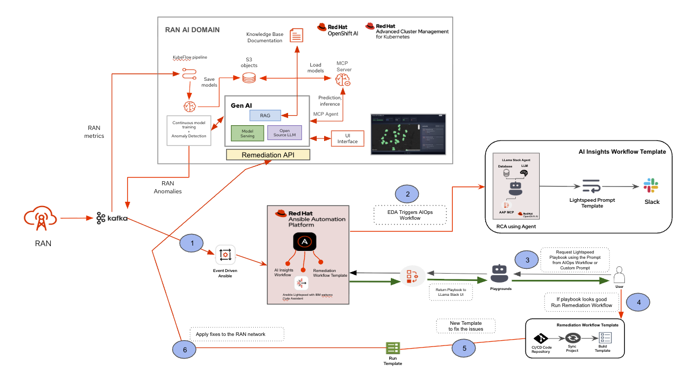
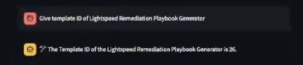
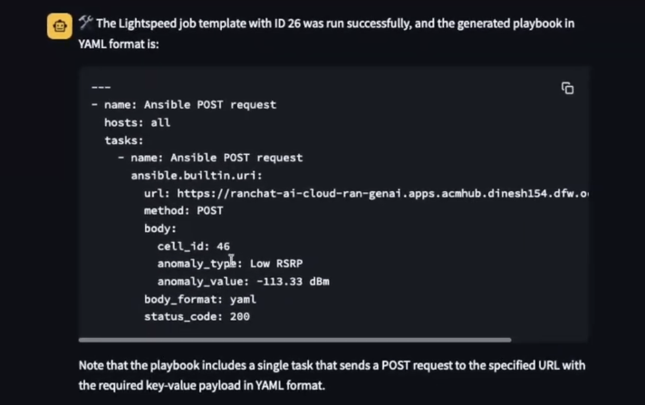

# AIOps Automation Solution with Ansible Automation Platform & LlamaStack on OpenShift

## 📌 Overview
This project demonstrates an **end-to-end AIOps automation framework** built using:
- **Ansible Automation Platform (AAP)**
- **OpenShift AI**
- **LLamaStack Agent**
- **Ansible Lightspeed**

The solution automates detection, analysis, notification, and remediation of node/service failures (e.g., HTTP service downtime).

---

## ⚙️ Workflow


This workflow demonstrates how Event-Driven Ansible (EDA), AI Insights, and Lightspeed integrate with Ansible Automation Platform (AAP) to detect, analyze, and remediate service outages using a combination of autonomous agents and human-in-the-loop automation.

### ✅ Prerequisites

Before you begin, ensure you have the following configured:

- **LlamaStack** on OpenShift → [OpenShift setup steps](./openshift/README.md)  
- **Ansible Automation Platform (AAP)** → [AAP setup steps](./AAP/Readme.md)

---
---

### 🚀 Steps to Run the Workflow

#### Step 1: Trigger the Workflow

1. **Run the AIOPS Pipeline to Receive Anomaly Details on Kafka Endpoint**

   Run the AIOPS pipeline to begin receiving anomaly details on the Kafka endpoint.

   You can verify the Kafka endpoint has received anomaly events using the following command.
    Check Entry on Mac

     Check entry on mac

         podman run --rm -it \
          --platform linux/arm64 \
          confluentinc/cp-kafka:7.6.0 \
          /usr/bin/kafka-console-consumer \
          --bootstrap-server <YOUR-SERVER>:9092 \
          --topic ai-ran-logs \
          --from-beginning


**Note:** This command uses Podman with the `linux/arm64` platform, which is appropriate for Apple Silicon (M1/M2/M3) Macs. Adjust the `--platform` flag if running on a different architecture.

2. **Verify a Successful Kafka Event**

   A successful entry will look like this:
      
      ```
      ### ACTION REQUIRED
      The cell with ID 40 on Band 71 is experiencing low RSRP (-119.48 dBm), which is
      below the threshold of -110 dBm. This indicates poor radio conditions, likely due
      to distance or obstructions, and may lead to reduced network performance. To address
      this, the antenna's azimuth and downtilt should be adjusted to redistribute traffic
      and improve signal strength.
      
      ### API CALL DETAILS
      Endpoint:
      POST https://ranchat-ai-cloud-ran-genai.apps.acmhub.dinesh154.dfw.ocp.run/api/ran
      
      JSON Payload:
      {
        "cell_id": 40,
        "anomaly_type": "Low RSRP",
        "anomaly_value": "-119.48 dBm",
        "threshold_value": "-110 dBm",
        "action": "Adjust antenna settings to improve signal strength",
        "azimuth_change": 5,
        "downtilt_change": 3
      }
      ```
      
3. **Verify Event Pickup in Event-Driven Ansible (EDA)**  
   - Navigate to **Automation Decisions → Rulebook Activations**.  
   - Confirm that **EDA** has detected and picked up the event.


4. **Confirm Workflow Execution in AAP Controller**  
   - Go to **Automation Controller → Jobs**.  
   - Look for the workflow named **AI Insights and Lightspeed Prompt Generation**.  
   - ✅ A successful run will be marked **green**.


5. **Verify Auto-Generated Remediation Template**
   - In AAP, navigate to Templates.
   - You should now see a newly created job template named "Lightspeed Remediation Playbook" Generator.
   - Open the template and edit it:
        - Under Extra Variables, add the following:

              lightspeed_prompt: null
        - Enable the **Prompt on launch** checkbox for this variable.

 6. **Review Slack Notifications**  
   - Open your Slack channel and review the automated notification.  
   - Key details included:  

     - 🛑 **HTTPD Error Logs**  
       Logs automatically collected from the webserver showing the failure.  

     - 🧠 **AI Insights (RCA)**  
       Red Hat AI parsed the logs and generated a **Root Cause Analysis (RCA)** explaining why the failure occurred.


#### Step 2: Remediation Workflow using Human-in-the-loop

Pick one event from the Kafka topic list and generate and execute an Ansible remediation playbook via Lightspeed.

The example below uses **Cell ID 55, Low RSRP** from the Kafka topic.

---

#### Step 1 — Log in to OpenShift Container Platform

Use your provided credentials to log in to the OpenShift Console.

---

#### Step 2 — Navigate to the LlamaStack UI

1. In the OpenShift Console, go to **Networking → Routes**.
2. Locate and click the route labelled **Streamlit** to open the **LlamaStack UI**.

---

#### Step 3 — Configure the MCP Server

1. In the LlamaStack UI, click **Tools**.
2. Under **MCP Servers**, select **mcp:aap**.
3. Set **Max Tokens** to at least **2000** to avoid truncated responses.

---

#### Step 4 — Interact with the AAP MCP Server

Issue the following four prompts **in sequence** in the LlamaStack UI.

---

**Prompt 1 — Find the Lightspeed Template ID**

```text
Give template ID of Lightspeed Remediation Playbook Generator
```

Expected response:



---

**Prompt 2 — Generate the Remediation Playbook**

```text
Run the Lightspeed job template with ID <ID-FROM-PREVIOUS-STEP>, passing the following extra_vars:
{
  "lightspeed_prompt": "POST JSON to https://ranchat-ai-cloud-ran-genai.apps.acmhub.dinesh154.dfw.ocp.run/api/ran with the following keys and values (cell_id: 46, anomaly_type: \"Low RSRP\", anomaly_value: -117.21, action: \"Improve RSRP\"). Execute against node1. Ensure validate_certs is set to true and all payload values are in quotes."
}
```

Review the generated playbook output before proceeding.



> ⚠️ **Note:** Ansible Lightspeed may hallucinate during playbook generation. Before continuing, verify that:
> - The playbook targets **`node1`** as the host.
> - **`validate_certs`** is set to `true`.
> - The **`cell_id`** value is correct (other payload values are less critical).
> - The number of **payload entries is kept minimal** — extra or unnecessary fields can cause unexpected behaviour.
> Re-prompt or manually correct the playbook if any of these conditions are not met.

---

**Prompt 3 — Run the Remediation Workflow**

Once the playbook looks correct, pass it to the Remediation Workflow template:

```text
 Run Remediation Workflow  Template  extra_vars is 
   
   { "lightspeed_playbook": <cleaned_yaml> }
```

---

**Prompt 4 — Execute the Playbook Job**

Finally, trigger the job by name:

```text
Run a job template by name <Name of the playbook>
```

Replace `<Name of the playbook>` with the name returned in the previous step.
